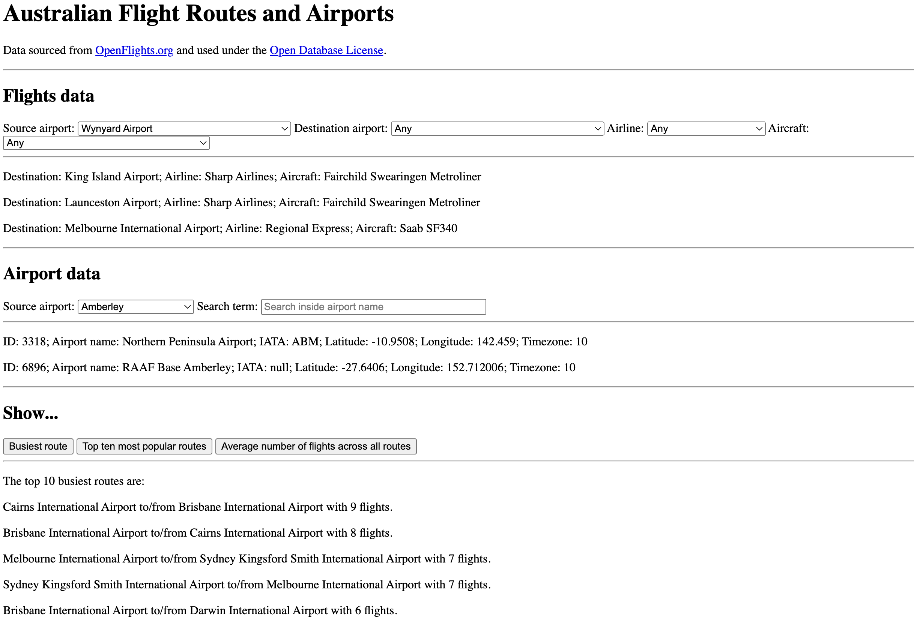

# Open Flights

  

This is a university assignment completed as part of my Graduate Certificate in Information Technology (Web Development) at the Queensland University of Technology.

The app contains at present no design or UI elements. It is a data visualisation project that consumes JSON data.

## Tech

- **Vanilla JavaScript** for data parsing, mapping and filtering; direct DOM manipulation.
- **JEST** for unit testing.

**_Please feel free to view the full report in the report directory._**
